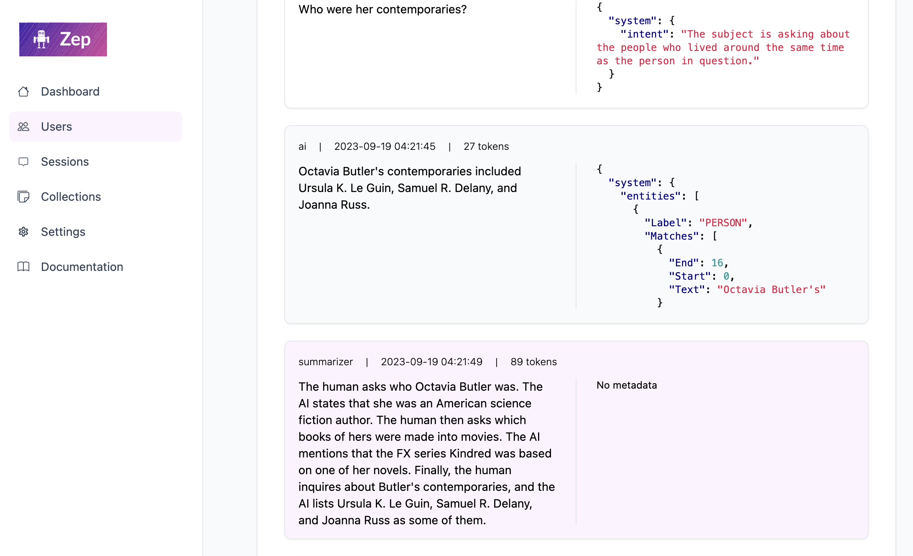

# Quick Start

Prefer deploying to the cloud?

<p style="display: flex; align-items: center;">
    <a class="md-button" href="https://www.getzep.com/#join-waitlist" style="margin-right: 20px; padding: inherit 15px; border-radius: 7px;">
        Join the Zep Cloud Waitlist &nbsp;
        <span class="twemoji">
            <svg xmlns="http://www.w3.org/2000/svg" viewBox="0 0 512 512">
                <!--! Font Awesome Free 6.4.0 by @fontawesome - https://fontawesome.com License - https://fontawesome.com/license/free (Icons: CC BY 4.0, Fonts: SIL OFL 1.1, Code: MIT License) Copyright 2023 Fonticons, Inc.-->
                <path d="M498.1 5.6c10.1 7 15.4 19.1 13.5 31.2l-64 416c-1.5 9.7-7.4 18.2-16 23s-18.9 5.4-28 1.6L284 427.7l-68.5 74.1c-8.9 9.7-22.9 12.9-35.2 8.1S160 493.2 160 480v-83.6c0-4 1.5-7.8 4.2-10.7l167.6-182.9c5.8-6.3 5.6-16-.4-22s-15.7-6.4-22-.7L106 360.8l-88.3-44.2C7.1 311.3.3 300.7 0 288.9s5.9-22.8 16.1-28.7l448-256c10.7-6.1 23.9-5.5 34 1.4z"></path>
            </svg>
        </span>
    </a>
- or -
    <a href="/deployment/render" style="display: flex; align-items: center; margin-left: 20px">
        
    </a>
</p>


### Starting a Zep server locally is simple.

1\. Clone the [Zep repo](https://github.com/getzep/zep)

```bash
git clone https://github.com/getzep/zep.git
```

&nbsp;

2\. Add your OpenAI API key to a `.env` file in the root of the repo:

```bash
ZEP_OPENAI_API_KEY=<your key here>
```

!!! note "Important"

    Zep uses OpenAI for chat history summarization, intent analysis, and, by default, embeddings. You can get an [Open AI Key here](https://openai.com/).

&nbsp;

3\. Start the Zep server:

```bash
docker-compose up
```

This will start a Zep server on port `8000`, and NLP and database server backends.

!!! Warning "Configure Server Authentication"

    If you are deploying Zep to a production environemnt or where Zep APIs are exposed to the public internet, 
    please ensure that you secure your Zep server by [configuring authentication](auth.md).
    Failing to do so will leave your server open to the public.

&nbsp;

4\. Get started with the [Zep SDKs](../sdk/index.md)!

- Install the **[Python](https://github.com/getzep/zep-python)** or **[Javascript](https://github.com/getzep/zep-js)**
  SDKs by following the [SDK Guide](../sdk/index.md).
- Looking to develop with LangChain or LlamaIndex? Check out Zep's [LangChain](../sdk/langchain.md) and [LlamaIndex](../sdk/llamaindex.md) support.

!!! note "Docker on Macs: Embedding is slow!"

    **For docker compose deployment we default to using OpenAI's embedding service.**
    
    Zep relies on PyTorch for embedding inference. On MacOS, Zep's NLP server runs in a Linux ARM64 container. PyTorch is not optimized to run on Linux ARM64 and does not have access to MacBook M-series acceleration hardware.
    
    
    Want to use local embeddings? See [Selecting Embedding Models](embeddings.md).

5\. Access the **Zep Web UI** at [http://localhost:8000/admin](http://localhost:8000/admin) (assuming you are running Zep locally)

<figure markdown style="border: 1px solid lightgrey; transition: box-shadow 125ms; border-radius: 0.2rem; ">
{ loading=lazy }
  <figcaption>Zep Web UI</figcaption>
</figure>

### Next Steps

- Setting up [authentication](auth.md)
- Developing with [Zep SDKs](../sdk/index.md)
- Learn about [Extractors](../sdk/extractors.md)
- Setting Zep [Configuration options](config.md)
- Learn about [deploying to production](production.md)
