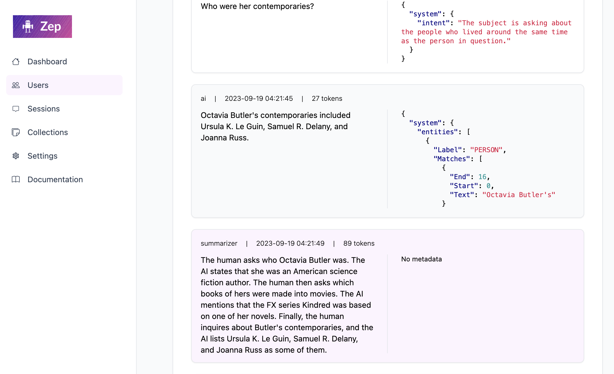

# Zep's Web Interface

Zep has a built-in Web UI for viewing and managing users, sessions, memories, collections, and more.

!!! warning "Do not enable the Web UI if deploying Zep to a public endpoint"

    The Web UI is not secured and should not be enabled if deploying Zep to a public endpoint. The JWT authentication configured for API access does not secure the Web UI.
    
    **Only enable the Web UI if your Zep install is not accessible by the public internet.**


## Enabling the Web UI

### Cloud Installs (including Render.com)
For security reasons, the Web UI is **disabled** by default for cloud installs of Zep. 

Steps to enable the Web UI:

1. See the **warning** above.
2. Set the `ZEP_SERVER_WEB_ENABLED` environment variable to `true` or [modify your `config.yaml` file](config.md).


### Local Installs (using `docker compose` or from source)

The Web UI is **enabled** by default for local installs. 

To disable it, set the `ZEP_SERVER_WEB_ENABLED` environment variable to `false` or [modify your `config.yaml` file](config.md).

## Accessing the Web UI

Point your browser to:

```bash
http://<zep-server-host>:<zep-server-port>/admin
```

for local installs, this will be:

```bash
http://localhost:8000/admin
```

<figure markdown style="border: 1px solid lightgrey; transition: box-shadow 125ms; border-radius: 0.2rem; ">
{ loading=lazy }
  <figcaption>Zep Web UI</figcaption>
</figure>